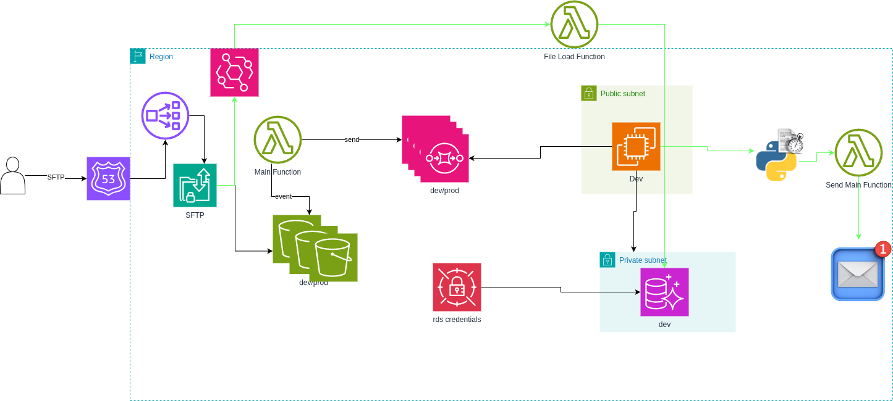
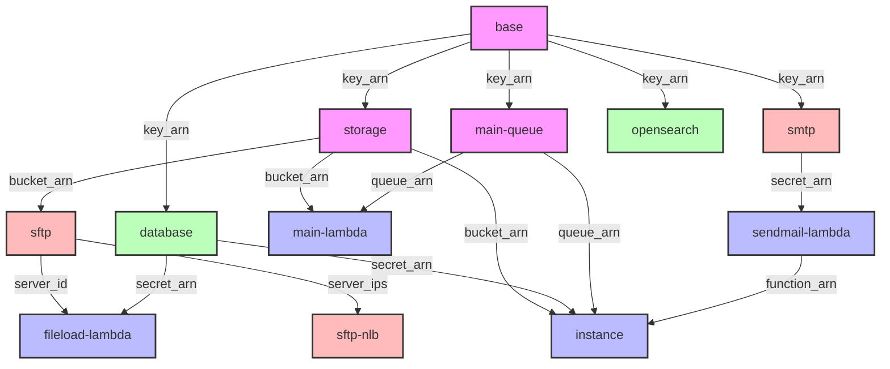

# AWS Infrastructure Documentation

Esta infraestructura despliega una solución completa para el procesamiento de archivos y datos

La arquitectura consta de:

- Servidor SFTP para la recepción de archivos
- Sistema de colas para el procesamiento de mensajes
- Cluster de base de datos en RDS
- Instancia EC2 para procesamiento
- Funciones Lambda para diferentes propósitos
- Cluster de OpenSearch para búsqueda y análisis
- Sistema de almacenamiento en S3
- Configuración SMTP para envío de correos

  

## Módulos

| Módulo                                       | Descripción                                                                        |
|----------------------------------------------|------------------------------------------------------------------------------------|
| [Base](modules/base)                         | Crea recursos compartidos como llaves KMS utilizadas por otros módulos             |
| [Storage](modules/storage)                   | Gestiona los buckets S3 para diferentes propósitos (landing, enriched, logs, etc.) |
| [SFTP](modules/sftp)                         | Configura un servidor SFTP seguro con acceso a S3                                  |
| [SFTP-NLB](modules/sftp-nlb)                 | Configura un Network Load Balancer para el acceso al servidor SFTP                 |
| [Main Queue](modules/main-queue)             | Configura las colas SQS para diferentes tipos de mensajes                          |
| [Database](modules/database)                 | Gestiona el cluster de base de datos RDS                                           |
| [Main Lambda](modules/main-lambda)           | Configura funciones Lambda para el procesamiento principal                         |
| [Fileload Lambda](modules/fileload-lambda)   | Lambda específica para la carga de archivos                                        |
| [EC2 Instance](modules/ec2-instance)         | Configura una instancia EC2 para procesamiento                                     |
| [SMTP](modules/smtp)                         | Configura recursos para el envío de correos                                        |
| [Send Mail Lambda](modules/send-mail-lambda) | Lambda para el envío de correos electrónicos                                       |
| [OpenSearch](modules/opensearch)             | Configura un dominio de OpenSearch                                                 |

### Dependencias del Módulo



## Variables

### Variables de Entorno

##### `global_tags`

- **Descripción**: Mapa de etiquetas globales que se aplicarán a los recursos.
- **Tipo**: `map(string)`
- **Valor por defecto**: `{}`

##### `stack_number`

- **Descripción**: Usado para evitar conflictos al desplegar varias instancias de esta infraestructura con el mismo
  nombre.
- **Tipo**: `string`
- **Valor por defecto**: `"00"`
- **Validación**:
    - Debe ser un número de dos dígitos (00 al 99)
    - Mensaje de error: "Stack Number solo permite valores de 00 al 99."

##### `prefix_resource_name`

- **Descripción**: Prefijo requerido para nombrar los recursos en el formato `{coid}-{assetid}-{appid}` o similar.
- **Tipo**: `string`
- **Valor por defecto**: `"aply-0001-gen-all"`
- **Validación**:
    - Debe contener solo letras minúsculas, números y guiones (`-`)

### Variables de Red

##### `vpc_id`

- **Descripción**: ID de la VPC donde se desplegarán los recursos.
- **Tipo**: `string`

##### `public_subnet_ids`

- **Descripción**: Lista de IDs de subredes públicas.
- **Tipo**: `list(string)`

##### `private_subnet_ids`

- **Descripción**: Lista de IDs de subredes privadas.
- **Tipo**: `list(string)`

##### `restricted_subnet_ids`

- **Descripción**: Lista de IDs de subredes restringidas.
- **Tipo**: `list(string)`

### Variables de SFTP

##### `sftp`

- **Descripción**: Configuración del servidor SFTP.
- **Tipo**: `object`
- **Atributos**:
    - **`subnet`**:
        - **Tipo**: `string`
        - **Descripción**: ID de la subred para el servidor SFTP
    - **`certificate_arn`**:
        - **Tipo**: `string`
        - **Valor por defecto**: `null`
        - **Descripción**: ARN del certificado SSL
    - **`custom_host_name`**:
        - **Tipo**: `string`
        - **Valor por defecto**: `null`
        - **Descripción**: Nombre de host personalizado
    - **`hosted_zone_id`**:
        - **Tipo**: `string`
        - **Valor por defecto**: `null`
        - **Descripción**: ID de la zona DNS
    - **`allowed_cidr`**:
        - **Tipo**: `map(string)`
        - **Valor por defecto**: `{}`
        - **Descripción**: Mapa de CIDRs permitidos
    - **`allowed_security_group`**:
        - **Tipo**: `map(string)`
        - **Valor por defecto**: `{}`
        - **Descripción**: Mapa de security groups permitidos

##### `sftp_nlb`

- **Descripción**: Configuración del Network Load Balancer para SFTP.
- **Tipo**: `object`
- **Atributos**:
    - **`certificate_arn`**:
        - **Tipo**: `string`
        - **Valor por defecto**: `null`
        - **Descripción**: ARN del certificado SSL
    - **`custom_host_name`**:
        - **Tipo**: `string`
        - **Valor por defecto**: `null`
        - **Descripción**: Nombre de host personalizado
    - **`hosted_zone_id`**:
        - **Tipo**: `string`
        - **Valor por defecto**: `null`
        - **Descripción**: ID de la zona DNS
    - **`allowed_cidr`**:
        - **Tipo**: `map(string)`
        - **Valor por defecto**: `{}`
        - **Descripción**: Mapa de CIDRs permitidos
    - **`allowed_security_group`**:
        - **Tipo**: `map(string)`
        - **Valor por defecto**: `{}`
        - **Descripción**: Mapa de security groups permitidos

### Variables de Base de Datos

##### `database`

- **Descripción**: Configuración de la base de datos.
- **Tipo**: `object`
- **Atributos**:
    - **`snapshot_identifier`**:
        - **Tipo**: `string`
        - **Descripción**: Identificador del snapshot para restaurar la base de datos

### Variables de Instancia EC2

##### `instance`

- **Descripción**: Configuración de la instancia EC2.
- **Tipo**: `object`
- **Atributos**:
    - **`ami`**:
        - **Tipo**: `string`
        - **Descripción**: ID de la AMI a utilizar
    - **`instance_type`**:
        - **Tipo**: `string`
        - **Descripción**: Tipo de instancia
    - **`key_pair`**:
        - **Tipo**: `string`
        - **Valor por defecto**: `null`
        - **Descripción**: Nombre del key pair
    - **`allowed_cidr`**:
        - **Tipo**: `object`
        - **Valor por defecto**: `{}`
        - **Descripción**: Objeto con CIDRs permitidos
        - **Atributos**:
            - **`all_traffic`**:
                - **Tipo**: `map(string)`
                - **Valor por defecto**: `{}`
                - **Descripción**: CIDRs permitidos para todo el tráfico
            - **`ssh`**:
                - **Tipo**: `map(string)`
                - **Valor por defecto**: `{}`
                - **Descripción**: CIDRs permitidos para SSH
    - **`allowed_security_group`**:
        - **Tipo**: `object`
        - **Valor por defecto**: `{}`
        - **Descripción**: Objeto con security groups permitidos
        - **Atributos**:
            - **`all_traffic`**:
                - **Tipo**: `map(string)`
                - **Valor por defecto**: `{}`
                - **Descripción**: Security groups permitidos para todo el tráfico
            - **`ssh`**:
                - **Tipo**: `map(string)`
                - **Valor por defecto**: `{}`
                - **Descripción**: Security groups permitidos para SSH

### Variables de OpenSearch

##### `opensearch`

- **Descripción**: Configuración del dominio OpenSearch.
- **Tipo**: `object`
- **Atributos**:
    - **`engine_version`**:
        - **Tipo**: `string`
        - **Valor por defecto**: `"OpenSearch_2.3"`
        - **Descripción**: Versión del motor
    - **`instance_type`**:
        - **Tipo**: `string`
        - **Valor por defecto**: `"t3.small.search"`
        - **Descripción**: Tipo de instancia
    - **`storage_size`**:
        - **Tipo**: `number`
        - **Valor por defecto**: `100`
        - **Descripción**: Tamaño de almacenamiento en GB
    - **`instance_count`**:
        - **Tipo**: `number`
        - **Valor por defecto**: `1`
        - **Descripción**: Número de instancias

## Ejemplo

```hcl
global_tags = {
  coid    = "example"
  assetid = "0001"
  appid   = "data"
  env     = "dev"
}
stack_number         = "01"
prefix_resource_name = "example-0001-data-dev"

vpc_id = "vpc-0123456789abcdef0"
private_subnet_ids = ["subnet-0123456789abcdef0", "subnet-0123456789abcdef1"]
public_subnet_ids = ["subnet-0123456789abcdef2", "subnet-0123456789abcdef3"]
restricted_subnet_ids = ["subnet-0123456789abcdef4", "subnet-0123456789abcdef5"]

sftp = {
  subnet           = "subnet-0123456789abcdef0"
  certificate_arn  = "arn:aws:acm:region:account:certificate/12345678-1234-1234-1234-123456789012"
  custom_host_name = "sftp.example.com"
  hosted_zone_id   = "Z1234567890ABCDEF"
  allowed_cidr = { office = "10.0.0.0/16" }
}

sftp_nlb = {
  certificate_arn  = "arn:aws:acm:region:account:certificate/12345678-1234-1234-1234-123456789012"
  custom_host_name = "sftp-nlb.example.com"
  hosted_zone_id   = "Z1234567890ABCDEF"
}

database = {
  snapshot_identifier = "arn:aws:rds:region:account:cluster-snapshot:example-snapshot"
}

instance = {
  ami           = "ami-0123456789abcdef0"
  instance_type = "t3.medium"
  key_pair      = "example-key"
  allowed_cidr = {
    all_traffic = { office = "10.0.0.0/16" }
    ssh = { vpn = "172.16.0.0/16" }
  }
}

opensearch = {
  engine_version = "OpenSearch_2.3"
  instance_type  = "t3.medium.search"
  storage_size   = 200
  instance_count = 2
}
```