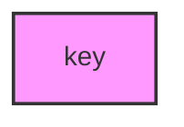

# Módulo Base

Crea una clave KMS que será utilizada por otros módulos para el cifrado de datos en sus recursos.

## Variables

#### `stack_number`

- **Descripción**: Usado para evitar conflictos al desplegar varias instancias de esta infraestructura con el mismo nombre.
- **Tipo**: `string`
- **Valor por defecto**: `"00"`
- **Validación**:
    - Debe ser un número de dos dígitos (00 al 99).
    - Mensaje de error: "Stack Number solo permite valores de 00 al 99."

#### `prefix_resource_name`

- **Descripción**: Prefijo requerido para nombrar los recursos en el formato `{coid}-{assetid}-{appid}` o similar.
- **Tipo**: `string`
- **Valor por defecto**: `"aply-0001-gen-all"`
- **Validación**:
    - Debe contener solo letras minúsculas, números y guiones (`-`).
    - Mensaje de error: "The prefix_resource_name value must be lowercase!"

#### `name`

- **Descripción**: Prefijo requerido para nombrar los recursos en el formato `{coid}-{assetid}-{appid}` o similar.
- **Tipo**: `string`
- **Requerido**: Sí

## Módulos Utilizados

| Módulo | Fuente | Descripción | Variables Requeridas |
|--------|---------|-------------|---------------------|
| `key` | `git@github.com:ITL-ORG-INFRA/intelica-module-kms//customer-key` | Crea una clave KMS personalizada | - name<br>- stack_number<br>- prefix_resource_name |

## Dependencias entre Módulos



## Detalles de Configuración

### Módulo Key (KMS)

- Crea una clave KMS personalizada para el cifrado de recursos
- La clave puede ser utilizada para cifrar:
    - Datos en reposo
    - Secretos
    - Mensajes en colas SQS
    - Volúmenes EBS
    - Otros servicios que requieran cifrado con KMS
- No tiene servicios permitidos específicos configurados por defecto

## Ejemplo de Uso

```hcl
module "base" {
  source = "./modules/base"

  name                 = "general"
  stack_number         = "01"
  prefix_resource_name = "example-0001-app-dev"
}
```