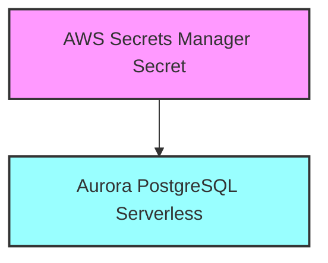

# Módulo Database

Crea una instancia de Aurora PostgreSQL Serverless v2 junto con un secreto en AWS Secrets Manager para almacenar las
credenciales de conexión.

## Variables

#### `stack_number`

- **Descripción**: Usado para evitar conflictos al desplegar varias instancias de esta infraestructura con el mismo
  nombre.
- **Tipo**: `string`
- **Valor por defecto**: `"00"`
- **Validación**:
    - Debe ser un número de dos dígitos (00 al 99).
    - Mensaje de error: "Stack Number solo permite valores de 00 al 99."

#### `prefix_resource_name`

- **Descripción**: Prefijo requerido para nombrar los recursos en el formato `{coid}-{assetid}-{appid}` o similar.
- **Tipo**: `string`
- **Valor por defecto**: `"aply-0001-gen-all"`
- **Validación**:
    - Debe contener solo letras minúsculas, números y guiones (`-`).
    - Mensaje de error: "The prefix_resource_name value must be lowercase!"

#### `name`

- **Descripción**: Nombre identificador para los recursos
- **Tipo**: `string`
- **Requerido**: Sí

#### `kms_key_arn`

- **Descripción**: ARN de la llave KMS para cifrado
- **Tipo**: `string`
- **Requerido**: Sí

#### `snapshot_identifier`

- **Descripción**: ARN del snapshot de BD para restaurar
- **Tipo**: `string`
- **Requerido**: Sí

#### `vpc_id`

- **Descripción**: ID de la VPC donde se desplegará el cluster
- **Tipo**: `string`
- **Requerido**: Sí

#### `database_subnet_ids`

- **Descripción**: Lista de IDs de subnets para el grupo de subnets de la BD
- **Tipo**: `list(string)`
- **Requerido**: Sí

#### `allowed_security_groups`

- **Descripción**: Lista de IDs de grupos de seguridad permitidos para conectarse al cluster
- **Tipo**: `list(string)`
- **Valor por defecto**: `[]`

#### `allowed_cidr_blocks`

- **Descripción**: Lista de bloques CIDR permitidos para conectarse al cluster
- **Tipo**: `list(string)`
- **Valor por defecto**: `[]`

#### `db_cluster_parameters`

- **Descripción**: Mapa de parámetros a aplicar al cluster de BD
- **Tipo**: `list(map(string))`
- **Valor por defecto**: `[]`

## Componentes y Módulos Utilizados

| Recurso                     | Tipo    | Fuente                                                                                                                                                  | Descripción                                       |
|-----------------------------|---------|---------------------------------------------------------------------------------------------------------------------------------------------------------|---------------------------------------------------|
| `aws_secretsmanager_secret` | Recurso | Recurso nativo de Terraform                                                                                                                             | Secret en Secrets Manager para credenciales de BD |
| `cluster_rds_serverless`    | Módulo  | [git@github.com:ITL-ORG-INFRA/intelica-module-rds//aurora-postgresql](https://github.com/ITL-ORG-INFRA/intelica-module-rds/tree/main/aurora-postgresql) | Cluster Aurora PostgreSQL serverless              |

## Recursos Creados

### AWS Secrets Manager Secret

- Nombre: `${prefix_resource_name}-secret-database-${name}-${stack_number}`
- Cifrado con la llave KMS proporcionada
- Formato requerido del secreto:

```json
{
  "username": "",
  "password": "",
  "engine": "postgres",
  "host": "",
  "port": 5432
}
```

### Aurora PostgreSQL Serverless

- Versión del motor: 16.2
- Configurado en la VPC especificada
- Grupo de subnets dedicado
- Acceso restringido por grupos de seguridad y CIDRs configurados
- Parámetros de cluster personalizables

## Dependencias entre Módulos



## Ejemplo de Uso

```hcl
module "database" {
  source = "./modules/database"

  name                 = "application"
  stack_number         = "01"
  prefix_resource_name = "example-0001-app-dev"
  kms_key_arn          = module.base.kms_key_arn

  snapshot_identifier = "arn:aws:rds:us-east-1:123456789012:snapshot:my-snapshot"
  vpc_id              = module.network.vpc_id
  database_subnet_ids = module.network.database_subnet_ids

  allowed_security_groups = [module.ecs.task_security_group_id]
  allowed_cidr_blocks = ["10.0.0.0/16"]

  db_cluster_parameters = [
    {
      name  = "timezone"
      value = "UTC"
    }
  ]
}
```

## Notas Importantes

1. El secreto debe ser actualizado después de la creación del cluster con las credenciales y endpoint correctos
2. La versión del motor PostgreSQL está fijada a 16.2
3. Se requiere proporcionar una llave KMS para el cifrado tanto del secreto como de la base de datos
4. El módulo espera un snapshot existente para la restauración inicial