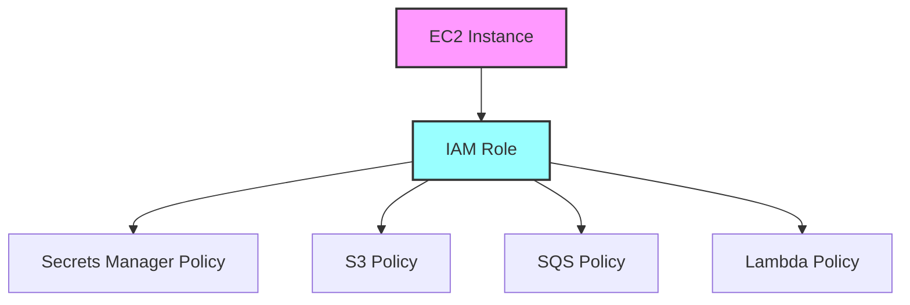

# Módulo EC2 Instance

Crea una instancia EC2 con permisos para interactuar con varios servicios de AWS incluyendo Secrets Manager, S3, SQS y
Lambda.

## Variables

#### `stack_number`

- **Descripción**: Usado para evitar conflictos al desplegar varias instancias de esta infraestructura con el mismo
  nombre.
- **Tipo**: `string`
- **Valor por defecto**: `"00"`
- **Validación**:
    - Debe ser un número de dos dígitos (00 al 99).
    - Mensaje de error: "Stack Number solo permite valores de 00 al 99."

#### `prefix_resource_name`

- **Descripción**: Prefijo requerido para nombrar los recursos en el formato `{coid}-{assetid}-{appid}` o similar.
- **Tipo**: `string`
- **Valor por defecto**: `"aply-0001-gen-all"`
- **Validación**:
    - Debe contener solo letras minúsculas, números y guiones (`-`).
    - Mensaje de error: "The prefix_resource_name value must be lowercase!"

#### `name`

- **Descripción**: Nombre identificador para los recursos
- **Tipo**: `string`
- **Requerido**: Sí

#### `vpc_id`

- **Descripción**: ID de la VPC donde se desplegará la instancia
- **Tipo**: `string`
- **Requerido**: Sí

#### `subnet_id`

- **Descripción**: ID de la subnet donde se desplegará la instancia
- **Tipo**: `string`
- **Requerido**: Sí

#### `key_pair`

- **Descripción**: Nombre del key pair para acceso SSH
- **Tipo**: `string`
- **Valor por defecto**: `null`
- **Opcional**: Sí

#### `ami`

- **Descripción**: ID de la AMI a utilizar
- **Tipo**: `string`
- **Requerido**: Sí

#### `instance_type`

- **Descripción**: Tipo de instancia EC2
- **Tipo**: `string`
- **Requerido**: Sí

#### `kms_key_arn`

- **Descripción**: ARN de la llave KMS para cifrado
- **Tipo**: `string`
- **Requerido**: Sí

#### `allowed_cidr`

- **Descripción**: Bloques CIDR permitidos para acceso
- **Tipo**: `object`
- **Valor por defecto**: `{}`
- **Estructura**:

```hcl
object({
all_traffic = optional(map(string), {})
ssh = optional(map(string), {})
})
```

#### `allowed_security_group`

- **Descripción**: Grupos de seguridad permitidos para acceso
- **Tipo**: `object`
- **Valor por defecto**: `{}`
- **Estructura**:

```hcl
object({
all_traffic = optional(map(string), {})
ssh = optional(map(string), {})
})
```

#### `buckets`

- **Descripción**: Mapa de buckets S3 y sus configuraciones
- **Tipo**: `map(object)`
- **Requerido**: Sí
- **Estructura**:

```hcl
map(object({
arn = string
prefix = optional(string, "/")
kms_key_arn = optional(string)
}))
```

#### `queues`

- **Descripción**: Mapa de colas SQS y sus configuraciones
- **Tipo**: `map(object)`
- **Requerido**: Sí
- **Estructura**:

```hcl
map(object({
arn = string
kms_key_arn = optional(string)
}))
```

#### `secrets`

- **Descripción**: Configuración de secretos en Secrets Manager
- **Tipo**: `object`
- **Requerido**: Sí
- **Estructura**:

```hcl
object({
interchange_database = object({
arn = string
kms_key_arn = optional(string)
})
})
```

#### `lambda`

- **Descripción**: Configuración de funciones Lambda
- **Tipo**: `object`
- **Requerido**: Sí
- **Estructura**:

```hcl
object({
send_mail = object({
arn = string
})
})
```

## Módulos Utilizados

| Módulo     | Fuente                                                       | Descripción            | Variables Requeridas                                                                                                                        |
|------------|--------------------------------------------------------------|------------------------|---------------------------------------------------------------------------------------------------------------------------------------------|
| `instance` | `git@github.com:ITL-ORG-INFRA/intelica-module-ec2//instance` | Crea una instancia EC2 | - name<br>- stack_number<br>- prefix_resource_name<br>- ami<br>- instance_type<br>- vpc_id<br>- subnet_id<br>- security_group<br>- key_pair |

## Políticas IAM Creadas

### Secrets Manager Policy

- Acceso a GetSecretValue para el secreto de base de datos
- Permisos KMS para operaciones de cifrado/descifrado

### S3 Policy

- ListBucket en los buckets especificados
- Operaciones CRUD de objetos en las rutas especificadas
- Permisos KMS para operaciones de cifrado/descifrado

### SQS Policy

- Operaciones completas de mensajería (envío, recepción, eliminación)
- Permisos KMS para operaciones de cifrado/descifrado

### Lambda Policy

- Permiso para invocar la función Lambda de envío de correos

## Dependencias entre Módulos



## Ejemplo de Uso

```hcl
module "application_server" {
  source = "./modules/application"

  name                 = "app-server"
  stack_number         = "01"
  prefix_resource_name = "example-0001-app-dev"

  vpc_id    = module.network.vpc_id
  subnet_id = module.network.private_subnet_ids[0]

  ami           = "ami-12345678"
  instance_type = "t3.medium"
  key_pair      = "my-key-pair"
  kms_key_arn   = module.base.kms_key_arn

  allowed_cidr = {
    ssh = {
      bastion = "10.0.0.0/24"
    }
  }

  allowed_security_group = {
    all_traffic = {
      internal = module.security_groups.internal_sg_id
    }
  }

  buckets = {
    data = {
      arn         = module.storage.bucket_arn
      prefix      = "data/"
      kms_key_arn = module.storage.kms_key_arn
    }
  }

  queues = {
    tasks = {
      arn         = module.queue.queue_arn
      kms_key_arn = module.queue.kms_key_arn
    }
  }

  secrets = {
    interchange_database = {
      arn         = module.database.secret_arn
      kms_key_arn = module.database.kms_key_arn
    }
  }

  lambda = {
    send_mail = {
      arn = module.notifications.lambda_arn
    }
  }
}
```

## Notas Importantes

1. La instancia requiere una AMI compatible con los servicios que se utilizarán
2. Se debe proporcionar una llave KMS para el cifrado de recursos
3. Los permisos de red (CIDR y grupos de seguridad) deben configurarse según la arquitectura de red
4. Las políticas IAM se crean automáticamente basadas en los recursos proporcionados
5. Todos los recursos referenciados (buckets, colas, secretos, funciones) deben existir previamente