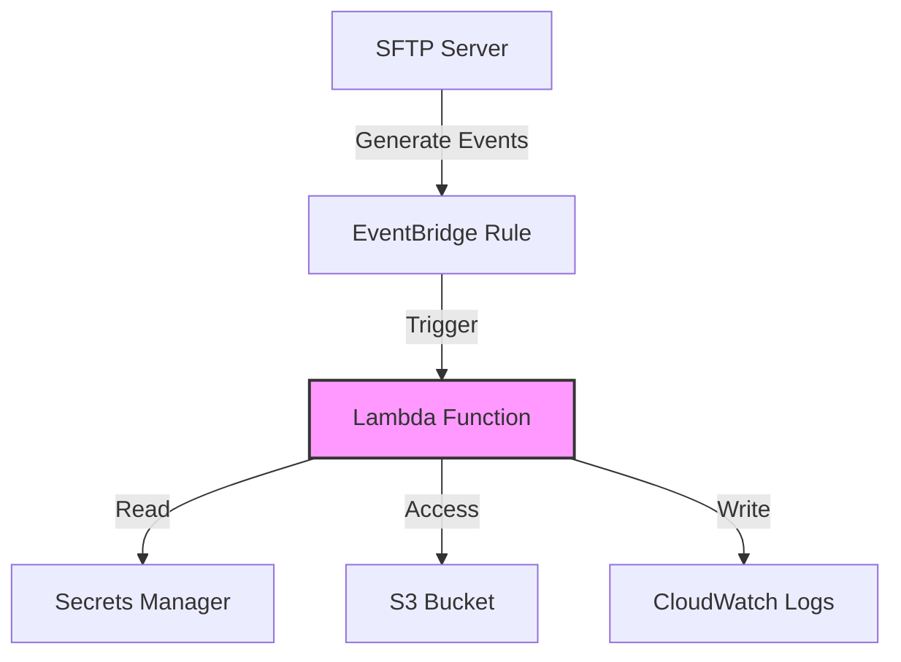

# Modulo File Load Lambda

Este módulo crea una función Lambda que procesa eventos de transferencia SFTP, con integración a Secrets Manager y
conexión a VPC.

## Descripción General

El módulo implementa una función Lambda con las siguientes características principales:

- Procesa eventos de carga de archivos SFTP (exitosos y fallidos)
- Se ejecuta dentro de una VPC específica
- Integración con Secrets Manager para acceder a credenciales de base de datos
- Capa de librerías Python personalizada
- Integración con CloudWatch Logs
- Utiliza la capa AWS SDK for Pandas

## Variables

#### `stack_number`

- **Descripción**: Identificador numérico para evitar conflictos en múltiples despliegues
- **Tipo**: `string`
- **Valor por defecto**: `"00"`
- **Validación**: Debe ser un número de dos dígitos (00 al 99)

#### `prefix_resource_name`

- **Descripción**: Prefijo para nombrar recursos en formato `{coid}-{assetid}-{appid}`
- **Tipo**: `string`
- **Valor por defecto**: `"aply-0001-gen-all"`
- **Validación**: Solo letras minúsculas, números y guiones

#### `name`

- **Descripción**: Identificador de la función Lambda
- **Tipo**: `string`
- **Requerido**: Sí

#### `vpc_id`

- **Descripción**: ID de la VPC donde se desplegará la función
- **Tipo**: `string`
- **Requerido**: Sí

#### `subnet_ids`

- **Descripción**: Lista de IDs de subnets para la función Lambda
- **Tipo**: `list(string)`
- **Requerido**: Sí

#### `sftp_server_id`

- **Descripción**: ID del servidor SFTP para monitorear
- **Tipo**: `string`
- **Requerido**: Sí

#### `bucket_name`

- **Descripción**: Nombre del bucket S3 para operaciones de la función
- **Tipo**: `string`
- **Requerido**: Sí

#### `secrets`

- **Descripción**: Configuración de secretos en Secrets Manager
- **Tipo**: `object`
- **Atributos**:
    - **`interchange_database`**:
        - **Tipo**: `object`
        - **Descripción**: Configuración del secreto de la base de datos
        - **Atributos**:
            - **`arn`**:
                - **Tipo**: `string`
                - **Descripción**: ARN del secreto en Secrets Manager
            - **`kms_key_arn`**:
                - **Tipo**: `string`
                - **Descripción**: ARN de la llave KMS usada para cifrar el secreto
                - **Requerido**: No

## Recursos Creados

### IAM Role y Políticas

1. **Role Principal** (`aws_iam_role.role`)
    - Permite que Lambda asuma el rol
    - Nombre: `{prefix}-lmbd-{name}-{stack_number}-role`

2. **CloudWatch Logs Policy** (`aws_iam_role_policy.cloudwatch_logs_policy`)
    - Permisos para crear y escribir logs
    - Acciones: CreateLogGroup, CreateLogStream, PutLogEvents

3. **Secrets Manager Policy** (`aws_iam_role_policy.secrets_manager_policy`)
    - Acceso a GetSecretValue para el secreto de base de datos
    - Permisos KMS asociados para cifrado/descifrado

4. **VPC Policy** (`aws_iam_role_policy.vpc_policy`)
    - Permisos para gestionar interfaces de red en la VPC

### Lambda Function y Componentes

1. **Python Library Layer** (`aws_lambda_layer_version.lambda_layer`)
    - Capa de librerías Python personalizadas
    - Compatible con Python 3.10

2. **Security Group** (`aws_security_group.security_group`)
    - Grupo de seguridad para la función Lambda
    - Regla de egreso para todo el tráfico (0.0.0.0/0)

3. **Lambda Function** (`aws_lambda_function.function`)
    - Runtime: Python 3.10
    - Timeout: 3 segundos
    - Handler: `src/lambda_fileload_rds.lambda_handler`
    - Variables de entorno:
        - INTERCHANGE_DATABASE_SECRET_ARN
        - BUCKET_NAME
    - Capas:
        - Capa de librerías Python personalizada
        - AWS SDK for Pandas

### EventBridge Integration

1. **Event Rule** (`aws_cloudwatch_event_rule.sft_event_rule`)
    - Monitorea eventos de transferencia SFTP
    - Tipos de eventos:
        - SFTP Server File Upload Failed
        - SFTP Server File Upload Completed

2. **Event Target** (`aws_cloudwatch_event_target.sft_event_rule_target`)
    - Conecta la regla de eventos con la función Lambda

3. **Lambda Permission** (`aws_lambda_permission.event_bridge`)
    - Permite que EventBridge invoque la función Lambda

## Diagrama



## Ejemplo de Uso

```hcl
module "sftp_processor" {
  source = "./modules/lambda-sftp-processor"

  name                 = "sftp-processor"
  stack_number         = "01"
  prefix_resource_name = "myapp-0001-sftp-dev"

  vpc_id = "vpc-12345678"
  subnet_ids = ["subnet-a1b2c3d4", "subnet-e5f6g7h8"]

  sftp_server_id = "s-1234567890abcdef0"
  bucket_name    = "my-sftp-bucket"

  secrets = {
    interchange_database = {
      arn         = "arn:aws:secretsmanager:region:account:secret:name"
      kms_key_arn = "arn:aws:kms:region:account:key/id"
    }
  }
}
```

## Notas Importantes

1. La función Lambda requiere acceso a red (VPC) para funcionar correctamente
2. Se debe proporcionar una capa de librerías Python en el archivo `layers/python-libs.zip`
3. El código fuente de la función debe estar en `src.zip`
4. La función utiliza la capa AWS SDK for Pandas predefinida
5. El timeout está configurado en 3 segundos, ajustar según necesidades
6. Asegurarse de que las subnets proporcionadas tengan acceso a los servicios necesarios (Secrets Manager, S3)

