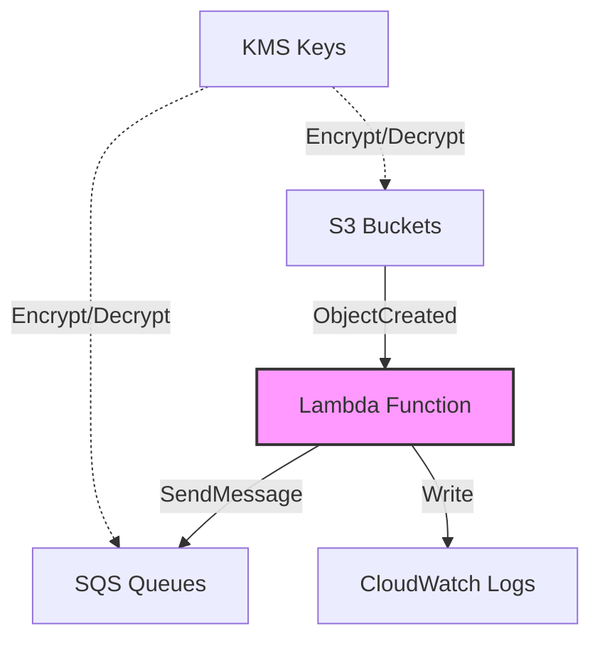

# Modulo Main Lambda

Este módulo crea una función Lambda que se activa con eventos de S3 y envía mensajes a colas SQS.

## Descripción General

El módulo implementa una función Lambda con las siguientes características principales:

- Se activa automáticamente cuando se crean objetos en los buckets S3 configurados
- Envía mensajes a las colas SQS especificadas
- Soporta múltiples buckets S3 como fuente
- Soporta múltiples colas SQS como destino
- Maneja cifrado KMS para ambos servicios

## Variables

#### `stack_number`

- **Descripción**: Identificador numérico para evitar conflictos en múltiples despliegues
- **Tipo**: `string`
- **Valor por defecto**: `"00"`
- **Validación**: Debe ser un número de dos dígitos (00 al 99)

#### `prefix_resource_name`

- **Descripción**: Prefijo para nombrar recursos en formato `{coid}-{assetid}-{appid}`
- **Tipo**: `string`
- **Valor por defecto**: `"aply-0001-gen-all"`
- **Validación**: Solo letras minúsculas, números y guiones

#### `name`

- **Descripción**: Identificador de la función Lambda
- **Tipo**: `string`
- **Requerido**: Sí

#### `sources`

- **Descripción**: Configuración de los buckets S3 de origen
- **Tipo**: `object`
- **Atributos**:
    - **`buckets`**:
        - **Tipo**: `map(object)`
        - **Descripción**: Mapa de configuraciones de buckets S3
        - **Atributos**:
            - **`arn`**:
                - **Tipo**: `string`
                - **Descripción**: ARN del bucket S3
            - **`prefix`**:
                - **Tipo**: `string`
                - **Descripción**: Prefijo para filtrar objetos en el bucket
                - **Valor por defecto**: `"/"`
                - **Requerido**: No
            - **`kms_key_arn`**:
                - **Tipo**: `string`
                - **Descripción**: ARN de la llave KMS usada para cifrar el bucket
                - **Requerido**: No

#### `targets`

- **Descripción**: Configuración de las colas SQS de destino
- **Tipo**: `object`
- **Atributos**:
    - **`queues`**:
        - **Tipo**: `map(object)`
        - **Descripción**: Mapa de configuraciones de colas SQS
        - **Atributos**:
            - **`arn`**:
                - **Tipo**: `string`
                - **Descripción**: ARN de la cola SQS
            - **`kms_key_arn`**:
                - **Tipo**: `string`
                - **Descripción**: ARN de la llave KMS usada para cifrar la cola
                - **Requerido**: No

## Componentes y Módulos Utilizados

| Recurso                      | Tipo    | Fuente                      | Descripción                                              |
|------------------------------|---------|-----------------------------|----------------------------------------------------------|
| `aws_iam_role`               | Recurso | Recurso nativo de Terraform | Role IAM para la función Lambda                          |
| `aws_iam_role_policy`        | Recurso | Recurso nativo de Terraform | Política IAM para acceso a buckets S3 de origen          |
| `aws_iam_role_policy`        | Recurso | Recurso nativo de Terraform | Política IAM para acceso a colas SQS de destino          |
| `aws_iam_role_policy`        | Recurso | Recurso nativo de Terraform | Política IAM para acceso a CloudWatch logs               |
| `aws_lambda_function`        | Recurso | Recurso nativo de Terraform | Función Lambda para procesamiento de archivos            |
| `aws_s3_bucket_notification` | Recurso | Recurso nativo de Terraform | Configuración de notificación de buckets S3 hacia Lambda |
| `aws_lambda_permission`      | Recurso | Recurso nativo de Terraform | Permisos para invocar Lambda desde buckets S3            |

## Diagrama



## Recursos Creados

### IAM Role y Políticas

1. **Role Principal** (`aws_iam_role.role`)
    - Permite que Lambda asuma el rol
    - Nombre: `{prefix}-lmbd-{name}-{stack_number}-role`

2. **S3 Source Policy** (`aws_iam_role_policy.source_s3_policy`)
    - Permisos para interactuar con los buckets S3 fuente
    - Acciones permitidas:
        - ListBucket
        - GetBucketLocation
        - GetObject, GetObjectAcl
        - PutObject, PutObjectAcl
        - DeleteObject
    - Incluye permisos KMS si se especifica

3. **SQS Target Policy** (`aws_iam_role_policy.target_sqs_policy`)
    - Permisos para enviar mensajes a las colas SQS
    - Acciones permitidas:
        - SendMessage
        - GetQueueAttributes
    - Incluye permisos KMS si se especifica

4. **CloudWatch Logs Policy** (`aws_iam_role_policy.cloudwatch_logs_policy`)
    - Permisos para crear y escribir logs

### Lambda Function y Triggers

1. **Lambda Function** (`aws_lambda_function.function`)
    - Runtime: Python 3.10
    - Timeout: 3 segundos
    - Handler: `src/trigger_app.lambda_handler`
    - Variables de entorno:
        - QUEUES_URL_MAP: Mapa JSON de nombres de cola a URLs de SQS

2. **S3 Bucket Notifications** (`aws_s3_bucket_notification.bucket_lambda_trigger`)
    - Configura triggers en cada bucket S3 para eventos ObjectCreated
    - Se crea uno por cada bucket configurado

3. **Lambda Permissions** (`aws_lambda_permission.bucket_invoke_permission`)
    - Permite que S3 invoque la función Lambda
    - Se crea uno por cada bucket configurado

## Ejemplo de Uso

```hcl
module "s3_to_sqs_trigger" {
  source = "./modules/s3-sqs-trigger"

  name                 = "file-processor"
  stack_number         = "01"
  prefix_resource_name = "myapp-0001-proc-dev"

  sources = {
    buckets = {
      incoming = {
        arn         = "arn:aws:s3:::my-incoming-bucket"
        prefix      = "uploads/"
        kms_key_arn = "arn:aws:kms:region:account:key/id"
      }
    }
  }

  targets = {
    queues = {
      processing = {
        arn         = "arn:aws:sqs:region:account:processing-queue"
        kms_key_arn = "arn:aws:kms:region:account:key/id"
      }
    }
  }
}
```

## Notas Importantes

1. El código fuente de la función debe estar en `src.zip`
2. La función Lambda tiene un timeout de 3 segundos por defecto
3. Los buckets S3 y colas SQS deben existir previamente
4. Si se usa KMS, asegurarse de que las políticas de las llaves permitan el uso por parte de la función Lambda
5. Las URLs de SQS se generan automáticamente a partir de los ARNs proporcionados

