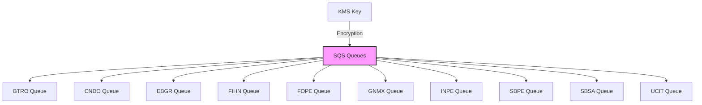

# Modulo Main Queue

Este módulo crea múltiples colas SQS estándar (no FIFO) utilizando un módulo SQS común.

## Descripción General

El módulo crea diez colas SQS con las siguientes características:

- Todas las colas son estándar (no FIFO)
- Comparten la misma configuración base
- Utilizan una llave KMS para cifrado
- Se crean usando el módulo `intelica-module-sqs/queue`

## Variables

#### `stack_number`

- **Descripción**: Identificador numérico para evitar conflictos en múltiples despliegues
- **Tipo**: `string`
- **Valor por defecto**: `"00"`
- **Validación**: Debe ser un número de dos dígitos (00 al 99)

#### `prefix_resource_name`

- **Descripción**: Prefijo para nombrar recursos en formato `{coid}-{assetid}-{appid}`
- **Tipo**: `string`
- **Valor por defecto**: `"aply-0001-gen-all"`
- **Validación**: Solo letras minúsculas, números y guiones

#### `name`

- **Descripción**: Identificador base para las colas SQS
- **Tipo**: `string`
- **Requerido**: Sí

#### `kms_key_arn`

- **Descripción**: ARN de la llave KMS para cifrar las colas SQS
- **Tipo**: `string`
- **Requerido**: Sí

## Componentes y Módulos Utilizados

| Recurso | Tipo   | Fuente                                                                                                                          | Descripción                           |
|---------|--------|---------------------------------------------------------------------------------------------------------------------------------|---------------------------------------|
| `btro`  | Módulo | [git@github.com:ITL-ORG-INFRA/intelica-module-sqs//queue](https://github.com/ITL-ORG-INFRA/intelica-module-sqs/tree/main/queue) | Cola SQS estándar (no FIFO) para btro |
| `cndo`  | Módulo | [git@github.com:ITL-ORG-INFRA/intelica-module-sqs//queue](https://github.com/ITL-ORG-INFRA/intelica-module-sqs/tree/main/queue) | Cola SQS estándar (no FIFO) para cndo |
| `ebgr`  | Módulo | [git@github.com:ITL-ORG-INFRA/intelica-module-sqs//queue](https://github.com/ITL-ORG-INFRA/intelica-module-sqs/tree/main/queue) | Cola SQS estándar (no FIFO) para ebgr |
| `fihn`  | Módulo | [git@github.com:ITL-ORG-INFRA/intelica-module-sqs//queue](https://github.com/ITL-ORG-INFRA/intelica-module-sqs/tree/main/queue) | Cola SQS estándar (no FIFO) para fihn |
| `fope`  | Módulo | [git@github.com:ITL-ORG-INFRA/intelica-module-sqs//queue](https://github.com/ITL-ORG-INFRA/intelica-module-sqs/tree/main/queue) | Cola SQS estándar (no FIFO) para fope |
| `gnmx`  | Módulo | [git@github.com:ITL-ORG-INFRA/intelica-module-sqs//queue](https://github.com/ITL-ORG-INFRA/intelica-module-sqs/tree/main/queue) | Cola SQS estándar (no FIFO) para gnmx |
| `inpe`  | Módulo | [git@github.com:ITL-ORG-INFRA/intelica-module-sqs//queue](https://github.com/ITL-ORG-INFRA/intelica-module-sqs/tree/main/queue) | Cola SQS estándar (no FIFO) para inpe |
| `sbpe`  | Módulo | [git@github.com:ITL-ORG-INFRA/intelica-module-sqs//queue](https://github.com/ITL-ORG-INFRA/intelica-module-sqs/tree/main/queue) | Cola SQS estándar (no FIFO) para sbpe |
| `sbsa`  | Módulo | [git@github.com:ITL-ORG-INFRA/intelica-module-sqs//queue](https://github.com/ITL-ORG-INFRA/intelica-module-sqs/tree/main/queue) | Cola SQS estándar (no FIFO) para sbsa |
| `ucit`  | Módulo | [git@github.com:ITL-ORG-INFRA/intelica-module-sqs//queue](https://github.com/ITL-ORG-INFRA/intelica-module-sqs/tree/main/queue) | Cola SQS estándar (no FIFO) para ucit |

## Diagrama



## Colas SQS Creadas

El módulo crea las siguientes colas SQS:

1. **BTRO** (`module.btro`)
    - Nombre: `{prefix_resource_name}-{name}-btro-{stack_number}`

2. **CNDO** (`module.cndo`)
    - Nombre: `{prefix_resource_name}-{name}-cndo-{stack_number}`

3. **EBGR** (`module.ebgr`)
    - Nombre: `{prefix_resource_name}-{name}-ebgr-{stack_number}`

4. **FIHN** (`module.fihn`)
    - Nombre: `{prefix_resource_name}-{name}-fihn-{stack_number}`

5. **FOPE** (`module.fope`)
    - Nombre: `{prefix_resource_name}-{name}-fope-{stack_number}`

6. **GNMX** (`module.gnmx`)
    - Nombre: `{prefix_resource_name}-{name}-gnmx-{stack_number}`

7. **INPE** (`module.inpe`)
    - Nombre: `{prefix_resource_name}-{name}-inpe-{stack_number}`

8. **SBPE** (`module.sbpe`)
    - Nombre: `{prefix_resource_name}-{name}-sbpe-{stack_number}`

9. **SBSA** (`module.sbsa`)
    - Nombre: `{prefix_resource_name}-{name}-sbsa-{stack_number}`

10. **UCIT** (`module.ucit`)
    - Nombre: `{prefix_resource_name}-{name}-ucit-{stack_number}`

## Componentes y Módulos Utilizados

| Módulo  | Fuente                                                    | Descripción                  |
|---------|-----------------------------------------------------------|------------------------------|
| `queue` | `git@github.com:ITL-ORG-INFRA/intelica-module-sqs//queue` | Crea una cola SQS individual |

## Ejemplo de Uso

```hcl
module "processing_queues" {
  source = "./modules/multiple-sqs-queues"

  name                 = "processing"
  stack_number         = "01"
  prefix_resource_name = "myapp-0001-proc-dev"
  kms_key_arn          = "arn:aws:kms:region:account:key/id"
}
```

## Notas Importantes

1. Todas las colas se crean como colas estándar (no FIFO)
2. Todas las colas comparten la misma llave KMS para cifrado
3. El nombre final de cada cola seguirá el patrón: `{prefix_resource_name}-{name}-{suffix}-{stack_number}`
4. La configuración detallada de cada cola (retención, visibilidad, etc.) se maneja en el módulo SQS subyacente

