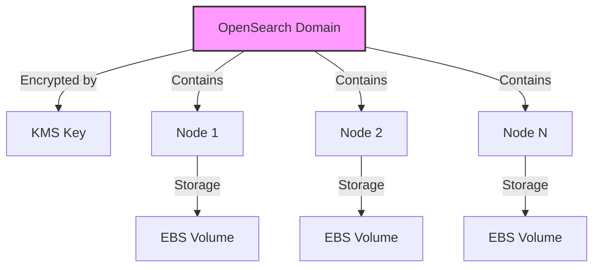

# Modulo OpenSearch

Este módulo crea un dominio de OpenSearch utilizando el módulo base `intelica-module-opensearch/domain`.

## Descripción General

El módulo implementa un dominio de OpenSearch con las siguientes características:

- Configuración flexible del tipo y número de instancias
- Cifrado mediante KMS
- Tamaño de almacenamiento configurable
- Versión del motor seleccionable

## Variables

#### `stack_number`

- **Descripción**: Identificador numérico para evitar conflictos en múltiples despliegues
- **Tipo**: `string`
- **Valor por defecto**: `"00"`
- **Validación**: Debe ser un número de dos dígitos (00 al 99)

#### `prefix_resource_name`

- **Descripción**: Prefijo para nombrar recursos en formato `{coid}-{assetid}-{appid}`
- **Tipo**: `string`
- **Valor por defecto**: `"aply-0001-gen-all"`
- **Validación**: Solo letras minúsculas, números y guiones

#### `name`

- **Descripción**: Nombre del dominio OpenSearch
- **Tipo**: `string`
- **Valor por defecto**: `null`
- **Requerido**: No

#### `engine_version`

- **Descripción**: Versión del motor OpenSearch a utilizar
- **Tipo**: `string`
- **Valor por defecto**: `"OpenSearch_2.3"`
- **Requerido**: No

#### `instance_type`

- **Descripción**: Tipo de instancia para los nodos de OpenSearch
- **Tipo**: `string`
- **Valor por defecto**: `"t3.small.search"`
- **Requerido**: No

#### `kms_key_arn`

- **Descripción**: ARN de la llave KMS para cifrado de datos
- **Tipo**: `string`
- **Requerido**: Sí

#### `storage_size`

- **Descripción**: Tamaño del almacenamiento en GB por nodo
- **Tipo**: `number`
- **Valor por defecto**: `100`
- **Requerido**: No

#### `instance_count`

- **Descripción**: Número de nodos en el clúster de OpenSearch
- **Tipo**: `number`
- **Valor por defecto**: `1`
- **Requerido**: No de Arquitectura



## Componentes y Módulos Utilizados

| Módulo   | Tipo   | Fuente                                                                                                                                          | Descripción                   |
|----------|--------|-------------------------------------------------------------------------------------------------------------------------------------------------|-------------------------------|
| `domain` | Módulo | [git@github.com:ITL-ORG-INFRA/intelica-module-opensearch//domain](https://github.com/ITL-ORG-INFRA/intelica-module-opensearch/tree/main/domain) | Crea un dominio de OpenSearch |

## Ejemplo de Uso

```hcl
module "search_cluster" {
  source = "./modules/opensearch"

  name                 = "search-cluster"
  stack_number         = "01"
  prefix_resource_name = "myapp-0001-search-dev"

  engine_version = "OpenSearch_2.3"
  instance_type  = "t3.medium.search"
  instance_count = 2
  storage_size   = 200

  kms_key_arn = "arn:aws:kms:region:account:key/id"
}
```

## Notas Importantes

1. El tamaño mínimo de almacenamiento recomendado es 100GB por nodo
2. Para entornos de producción, se recomienda usar más de un nodo para alta disponibilidad
3. El tipo de instancia `t3.small.search` es adecuado para desarrollo pero puede no ser suficiente para producción
4. La versión del motor predeterminada (OpenSearch 2.3) puede actualizarse según necesidades
5. El cifrado con KMS es obligatorio para todos los dominios

## Configuraciones Recomendadas

### Desarrollo

```hcl
instance_type  = "t3.small.search"
instance_count = 1
storage_size   = 100
```

### Producción Básica

```hcl
instance_type  = "t3.medium.search"
instance_count = 2
storage_size   = 200
```

### Producción de Alto Rendimiento

```hcl
instance_type  = "m6g.large.search"
instance_count = 3
storage_size   = 500
```