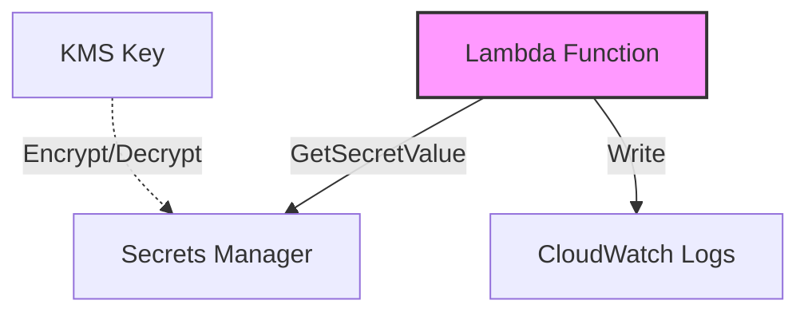

# Módulo Send Mail Lambda

Este módulo crea una función Lambda en AWS con acceso a Secrets Manager para recuperar credenciales SMTP, con lo cuales
realiza en el envio de correos electrónicos a las direcciones indicadas en el evento de lambda.

## Descripción General

El módulo implementa una función Lambda con las siguientes características principales:

- Accede a un secreto SMTP almacenado en AWS Secrets Manager
- Configura permisos de CloudWatch Logs para registro de eventos
- Soporta cifrado KMS para el manejo seguro de secretos

## Variables

#### `stack_number`

- **Descripción**: Identificador numérico para evitar conflictos en múltiples despliegues
- **Tipo**: `string`
- **Valor por defecto**: `"00"`
- **Validación**: Debe ser un número de dos dígitos (00 al 99)

#### `prefix_resource_name`

- **Descripción**: Prefijo para nombrar recursos en formato `{coid}-{assetid}-{appid}`
- **Tipo**: `string`
- **Valor por defecto**: `"aply-0001-gen-all"`
- **Validación**: Solo letras minúsculas, números y guiones

#### `name`

- **Descripción**: Identificador de la función Lambda
- **Tipo**: `string`
- **Requerido**: Sí

#### `secrets`

- **Descripción**: Configuración del secreto SMTP en Secrets Manager
- **Tipo**: `object`
- **Atributos**:
    - **`smtp`**:
        - **Tipo**: `object`
        - **Descripción**: Configuración del secreto SMTP
        - **Atributos**:
            - **`arn`**:
                - **Tipo**: `string`
                - **Descripción**: ARN del secreto SMTP en Secrets Manager
                - **Requerido**: Sí
            - **`kms_key_arn`**:
                - **Tipo**: `string`
                - **Descripción**: ARN de la llave KMS usada para cifrar el secreto
                - **Requerido**: No (opcional)

## Diagrama



## Recursos Creados

### IAM Role y Políticas

1. **Role Principal** (`aws_iam_role.role`)
    - Permite que Lambda asuma el rol
    - Nombre: `{prefix}-lmbd-{name}-{stack_number}-role`

2. **CloudWatch Logs Policy** (`aws_iam_role_policy.cloudwatch_logs_policy`)
    - Permisos para crear y escribir logs
    - Acciones permitidas:
        - logs:CreateLogGroup
        - logs:CreateLogStream
        - logs:PutLogEvents
    - Recurso: "*" (todos los logs)

3. **Secrets Manager Policy** (`aws_iam_role_policy.secrets_manager_policy`)
    - Permisos para acceder al secreto SMTP específico
    - Acciones permitidas:
        - secretsmanager:GetSecretValue
    - Recurso: ARN del secreto SMTP
    - Incluye permisos KMS si se especifica:
        - kms:Encrypt, kms:Decrypt, kms:ReEncrypt*
        - kms:GenerateDataKey*, kms:DescribeKey

### Lambda Function

1. **Lambda Function** (`aws_lambda_function.function`)
    - Nombre: `{prefix}-lmbd-{name}-{stack_number}`
    - Runtime: Python 3.10
    - Timeout: 3 segundos
    - Handler: `src/lambda_function.lambda_handler`
    - Variables de entorno:
        - SMTP_SECRET_ARN: ARN del secreto SMTP

## Ejemplo de Uso

```hcl
module "email_notification_lambda" {
  source = "./modules/lambda-smtp"

  name                 = "email-notifier"
  stack_number         = "01"
  prefix_resource_name = "myapp-0001-notif-dev"

  secrets = {
    smtp = {
      arn         = "arn:aws:secretsmanager:us-east-1:123456789012:secret:smtp-credentials"
      kms_key_arn = "arn:aws:kms:us-east-1:123456789012:key/1234abcd-12ab-34cd-56ef-1234567890ab"
    }
  }
}
```

## Notas Importantes

1. El código fuente de la función debe estar en `src.zip` en la raíz del módulo
2. Se espera que el handler de la función esté en `src/lambda_function.lambda_handler`
3. La función Lambda tiene un timeout predeterminado de 3 segundos
4. El secreto SMTP debe existir previamente en Secrets Manager
5. Si se usa KMS, asegurarse de que las políticas de la llave permitan su uso por parte de la función Lambda
6. El módulo no configura ningún trigger para la Lambda; debe configurarse por separado si es necesario