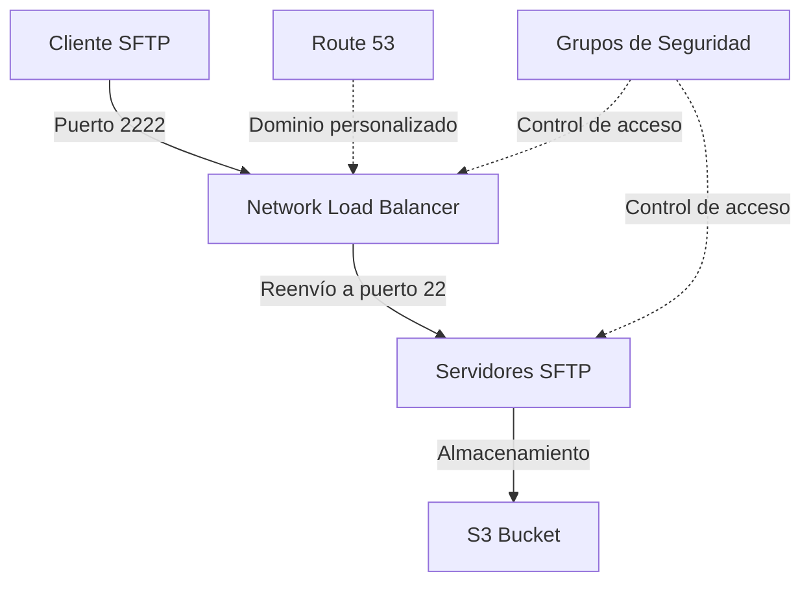

# Módulo SFTP con Network Load Balancer

Este módulo implementa un Network Load Balancer (NLB) como punto de entrada a un servidor SFTP utilizando AWS Transfer
Family, permitiendo personalizar el puerto de acceso a Servidor SFTP de AWS Transfer Family.

## Descripción General

El módulo implementa una arquitectura SFTP con las siguientes características:

- Network Load Balancer (NLB) como punto de entrada para conexiones SFTP
- Direccionamiento de tráfico a uno o más servidores SFTP mediante direcciones IP
- Control de acceso mediante grupos de seguridad y rangos CIDR
- Soporte opcional para dominio personalizado con Route 53
- Puerto personalizado (2222) para conexiones SFTP

## Variables

#### `stack_number`

- **Descripción**: Identificador numérico para evitar conflictos en múltiples despliegues
- **Tipo**: `string`
- **Valor por defecto**: `"00"`
- **Validación**: Debe ser un número de dos dígitos (00 al 99)

#### `prefix_resource_name`

- **Descripción**: Prefijo para nombrar recursos en formato `{coid}-{assetid}-{appid}`
- **Tipo**: `string`
- **Valor por defecto**: `"aply-0001-gen-all"`
- **Validación**: Solo letras minúsculas, números y guiones

#### `name`

- **Descripción**: Identificador del servidor SFTP y recursos asociados
- **Tipo**: `string`
- **Requerido**: Sí

#### `vpc_id`

- **Descripción**: ID de la VPC donde se desplegará la infraestructura
- **Tipo**: `string`
- **Requerido**: Sí

#### `subnet_ids`

- **Descripción**: Lista de IDs de subredes para el despliegue del NLB
- **Tipo**: `list(string)`
- **Requerido**: Sí

#### `is_internet_facing`

- **Descripción**: Determina si el NLB es accesible desde internet
- **Tipo**: `string` (boolean)
- **Valor por defecto**: `true`

#### `custom_host_name`

- **Descripción**: Nombre de host personalizado para el NLB
- **Tipo**: `string`
- **Valor por defecto**: `null`
- **Requerido**: No

#### `hosted_zone_id`

- **Descripción**: ID de la zona alojada en Route 53 para el dominio personalizado
- **Tipo**: `string`
- **Valor por defecto**: `null`
- **Requerido**: No

#### `certificate_arn`

- **Descripción**: ARN del certificado SSL/TLS (comentado en el código actual)
- **Tipo**: `string`
- **Valor por defecto**: `null`
- **Requerido**: No

#### `allowed_cidr`

- **Descripción**: Mapa de CIDRs permitidos para conectarse al NLB
- **Tipo**: `map(string)`
- **Valor por defecto**: `{}`
- **Requerido**: No

#### `allowed_security_group`

- **Descripción**: Mapa de grupos de seguridad permitidos para conectarse al NLB
- **Tipo**: `map(string)`
- **Valor por defecto**: `{}`
- **Requerido**: No

#### `sftp_server_ips`

- **Descripción**: Lista de direcciones IP de los servidores SFTP backend
- **Tipo**: `list(string)`
- **Requerido**: Sí

## Diagrama



## Recursos Creados

El módulo crea los siguientes recursos a través de los módulos subyacentes:

1. **Network Load Balancer (NLB)**
    - Implementado mediante el módulo `intelica-module-load-balancer/network-load-balancer`
    - Configurado para exponer el puerto 2222 para conexiones SFTP
    - Opcionalmente accesible desde internet según `is_internet_facing`

2. **Configuración de Target Group IP**
    - Implementado mediante el módulo `intelica-module-load-balancer/network-load-balancer-ip-application`
    - Dirige el tráfico desde el puerto 2222 del NLB al puerto 22 de los servidores SFTP
    - Utiliza direcciones IP estáticas como targets (`target_ips`)

3. **Configuración de Seguridad**
    - Grupos de seguridad configurados según los parámetros proporcionados
    - Reglas de ingreso basadas en CIDR e IDs de grupos de seguridad
    - Restricción de acceso al puerto 2222

4. **Configuración de DNS (opcional)**
    - Registro DNS en Route 53 si se proporcionan `custom_host_name` y `hosted_zone_id`

## Ejemplo de Uso

```hcl
module "sftp_nlb_example" {
  source = "ruta/al/modulo"

  name                 = "customer-sftp"
  stack_number         = "01"
  prefix_resource_name = "myapp-0001-sftp-prod"

  vpc_id = "vpc-0abc123def456789"
  subnet_ids = ["subnet-0abc123def456789", "subnet-0def456789abc123"]

  is_internet_facing = true

  custom_host_name = "sftp.example.com"
  hosted_zone_id   = "Z1234567890ABCDEFGHIJ"

  allowed_cidr = {
    office = "192.168.1.0/24",
    vpn    = "10.0.0.0/16"
  }

  allowed_security_group = {
    app_servers = "sg-0abc123def456789"
  }

  sftp_server_ips = ["10.0.1.100", "10.0.2.100"]
}
```