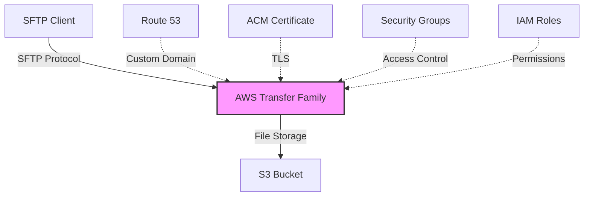

# Módulo SFTP

Este módulo crea un servidor SFTP basado en AWS Transfer Family con integración a buckets S3.

## Descripción General

El módulo implementa un servidor SFTP con las siguientes características principales:

- Acceso a uno o más buckets S3 como almacenamiento backend
- Configuración de usuarios con directorios home específicos
- Soporte para conexiones cifradas vía SFTP
- Control de acceso mediante grupos de seguridad y CIDR
- Opción para configuración de dominio personalizado con Route 53

## Variables

#### `stack_number`

- **Descripción**: Identificador numérico para evitar conflictos en múltiples despliegues
- **Tipo**: `string`
- **Valor por defecto**: `"00"`
- **Validación**: Debe ser un número de dos dígitos (00 al 99)

#### `prefix_resource_name`

- **Descripción**: Prefijo para nombrar recursos en formato `{coid}-{assetid}-{appid}`
- **Tipo**: `string`
- **Valor por defecto**: `"aply-0001-gen-all"`
- **Validación**: Solo letras minúsculas, números y guiones

#### `name`

- **Descripción**: Identificador del servidor SFTP
- **Tipo**: `string`
- **Requerido**: Sí

#### `region`

- **Descripción**: Región de AWS donde se desplegará el servidor SFTP
- **Tipo**: `string`
- **Requerido**: Sí

#### `vpc_id`

- **Descripción**: ID de la VPC donde se desplegará el servidor SFTP
- **Tipo**: `string`
- **Requerido**: Sí

#### `subnet_ids`

- **Descripción**: Lista de IDs de subredes para el despliegue del servidor SFTP
- **Tipo**: `list(string)`
- **Requerido**: Sí

#### `custom_host_name`

- **Descripción**: Nombre de host personalizado para el servidor SFTP
- **Tipo**: `string`
- **Valor por defecto**: `null`
- **Requerido**: No

#### `hosted_zone_id`

- **Descripción**: ID de la zona alojada en Route 53 para el dominio personalizado
- **Tipo**: `string`
- **Valor por defecto**: `null`
- **Requerido**: No

#### `certificate_arn`

- **Descripción**: ARN del certificado SSL/TLS para el servidor SFTP
- **Tipo**: `string`
- **Valor por defecto**: `null`
- **Requerido**: No

#### `buckets`

- **Descripción**: Configuración de los buckets S3 accesibles desde el servidor SFTP
- **Tipo**: `object`
- **Requerido**: Sí
- **Atributos**:
    - **`landing`**:
        - **Tipo**: `object`
        - **Descripción**: Configuración del bucket principal
        - **Atributos**:
            - **`arn`**:
                - **Tipo**: `string`
                - **Descripción**: ARN del bucket S3
                - **Requerido**: Sí
            - **`kms_key_arn`**:
                - **Tipo**: `string`
                - **Descripción**: ARN de la llave KMS usada para cifrar el bucket
                - **Requerido**: No (opcional)

#### `allowed_cidr`

- **Descripción**: Mapa de CIDRs permitidos para conectarse al servidor SFTP
- **Tipo**: `map(string)`
- **Valor por defecto**: `{}`
- **Requerido**: No

#### `allowed_security_group`

- **Descripción**: Mapa de grupos de seguridad permitidos para conectarse al servidor SFTP
- **Tipo**: `map(string)`
- **Valor por defecto**: `{}`
- **Requerido**: No

## Componentes y Módulos Utilizados

| Recurso       | Tipo   | Fuente                                                                                                                                                                    | Descripción                                               |
|---------------|--------|---------------------------------------------------------------------------------------------------------------------------------------------------------------------------|-----------------------------------------------------------|
| `sftp_server` | Módulo | [git@github.com:ITL-ORG-INFRA/intelica-module-transfer-family//sftp-s3-server](https://github.com/ITL-ORG-INFRA/intelica-module-transfer-family/tree/main/sftp-s3-server) | Crea un servidor SFTP de AWS Tranfer Family de dominio S3 |

## Diagrama



## Recursos Creados

El módulo crea los siguientes recursos a través del módulo subyacente `intelica-module-transfer-family/sftp-s3-server`:

1. **Servidor AWS Transfer Family**
    - Configurado para el protocolo SFTP
    - Conectado al dominio S3 para almacenamiento
    - Accesible desde internet (`is_internet_facing = true`)

2. **Configuración de Usuarios**
    - Usuario `usr_cdno` con directorio home específico
    - Directorio home mapeado al bucket especificado con prefijo "CNDO"

3. **Configuración de Seguridad**
    - Grupos de seguridad configurados según los parámetros proporcionados
    - Reglas de ingreso basadas en CIDR e IDs de grupos de seguridad
    - Integración opcional con certificados SSL/TLS

4. **Configuración de DNS (opcional)**
    - Registro DNS en Route 53 si se proporcionan `custom_host_name` y `hosted_zone_id`
    - Asociación con certificado ACM si se proporciona `certificate_arn`

## Ejemplo de Uso

```hcl
module "sftp_server_example" {
  source = "git@github.com:ITL-ORG-INFRA/intelica-module-transfer-family//sftp-s3-server"

  name                 = "customer-files"
  stack_number         = "01"
  prefix_resource_name = "myapp-0001-sftp-prod"
  region               = "us-east-1"
  
  vpc_id     = "vpc-0abc123def456789"
  subnet_ids = ["subnet-0abc123def456789", "subnet-0def456789abc123"]
  
  buckets = {
    landing = {
      arn         = "arn:aws:s3:::myapp-customer-files-bucket"
      kms_key_arn = "arn:aws:kms:us-east-1:123456789012:key/1234abcd-12ab-34cd-56ef-1234567890ab"
    }
  }
  
  custom_host_name = "sftp.example.com"
  hosted_zone_id   = "Z1234567890ABCDEFGHIJ"
  certificate_arn  = "arn:aws:acm:us-east-1:123456789012:certificate/12345678-1234-1234-1234-123456789012"
  
  allowed_cidr = {
    office = "192.168.1.0/24",
    vpn    = "10.0.0.0/16"
  }
  
  allowed_security_group = {
    app_servers = "sg-0abc123def456789"
  }
}
```

## Configuración de Usuarios

Este módulo configura por defecto un usuario `usr_cdno` con acceso al bucket especificado. El usuario tiene las siguientes características:

- **Home Directory**: Configurado en el bucket definido bajo la clave "landing"
- **Prefix**: Los archivos se guardarán con prefijo "CNDO/" en el bucket
