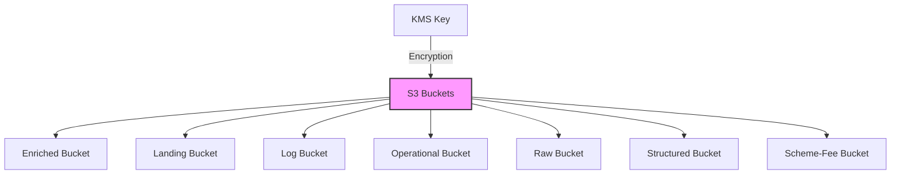

# Modulo Main Queue

Este módulo crea bucket de S3 utilizando un módulo S3 común.

## Variables

#### `stack_number`

- **Descripción**: Identificador numérico para evitar conflictos en múltiples despliegues
- **Tipo**: `string`
- **Valor por defecto**: `"00"`
- **Validación**: Debe ser un número de dos dígitos (00 al 99)

#### `prefix_resource_name`

- **Descripción**: Prefijo para nombrar recursos en formato `{coid}-{assetid}-{appid}`
- **Tipo**: `string`
- **Valor por defecto**: `"aply-0001-gen-all"`
- **Validación**: Solo letras minúsculas, números y guiones

#### `kms_key_arn`

- **Descripción**: ARN de la llave KMS para cifrar las colas SQS
- **Tipo**: `string`
- **Requerido**: Sí

## Diagrama



## Bucket S3 Creadas

El módulo crea las siguientes colas SQS:

1. **Enriched** (`module.enriched`)
    - Nombre: `{prefix_resource_name}-s3-enriched-{stack_number}`

2. **Landing** (`module.landing`)
    - Nombre: `{prefix_resource_name}-s3-landing-{stack_number}`

3. **Log** (`module.log`)
    - Nombre: `{prefix_resource_name}-s3-log-{stack_number}`

4. **Operational** (`module.operational`)
    - Nombre: `{prefix_resource_name}-s3-operational-{stack_number}`

5. **Raw** (`module.raw`)
    - Nombre: `{prefix_resource_name}-s3-raw-{stack_number}`

6. **scheme-fee** (`module.scheme-fee`)
    - Nombre: `{prefix_resource_name}-s3-scheme-fee-{stack_number}`

## Componentes y Módulos Utilizados

| Recurso  | Tipo   | Fuente                                                                                                                          | Descripción                  |
|----------|--------|---------------------------------------------------------------------------------------------------------------------------------|------------------------------|
| `bucket` | Módulo | [git@github.com:ITL-ORG-INFRA/intelica-module-s3//bucket](https://github.com/ITL-ORG-INFRA/intelica-module-s3/tree/main/bucket) | Crea un bucket S3 individual |

## Ejemplo de Uso

```hcl
module "storage" {
  source = "./modules/storage"
   
  stack_number         = "01"
  prefix_resource_name = "myapp-0001-proc-dev"
  kms_key_arn          = "arn:aws:kms:region:account:key/id"
}
```